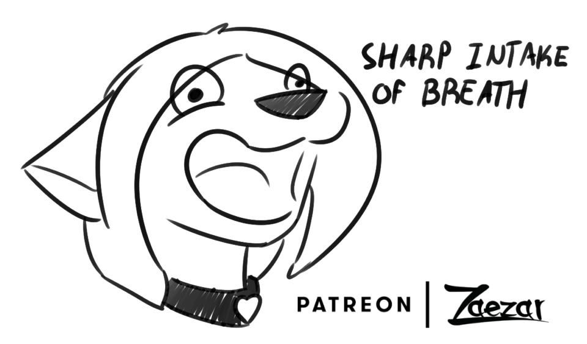

# Caroline's Art Gallery

This is a gallery of images of my [fursona, Caroline](/caroline/fursona). Enjoy!

Alt-text note: Any image not fully described is probably a flat-shaded or unshaded head shot or bust.

## Art by [Zaezar](https://www.zaezardraws.com)

Anything without a story here is probably a freebie,
because Zaezar frequently has freebie raffle art streams
and there used to be a lot fewer participants,
to the point where it was almost a guaranteed win.
I still participate in these sometimes, but it's much less common to win.

**Pre-design**

This art is from before I had a reference!
The art didn't follow a specific design, just what I told Zaezar the character looked like.

### 2017

This Christmas gift piece was surprisingly on-model for having been made before Caroline was officially designed.
This could also be interpreted as an image of [CJ],
the character that was born out of the first off-model images ever drawn of Caroline.

This is the first piece of art I ever commissioned.
I wish I had the foresight to wait for an official reference.

---

**Post-design**

In 2018, I actually commissioned a reference sheet for Caroline and thus she finally had an official design!

### 2018

If you ever make art of Caroline, you should use this reference:

??? message "Personal Edit"
    These are some quick edits I made after Zaezar posted these. 
    The lines are sloppy, but I love them.
    
    

??? message "Personal Edit"
    This is an edit I made after Zaezar sent me this sketch. 
    I'm actually quite pleased with the result.
     
    I now use this image attached to a cube as the official logo for the halotroop organization.

This one came as a pair with my ex-boyfriend. I think they turned out pretty cute. 
I just wish I had gotten the lines while they could still be had! 
Click the image to see the source, if you'd like to see them together.

### 2019

??? message "Personal Edit"
    This is an edit I made after Zaezar sent me the lines.
    

### 2020

Caroline dressed as Bat-Girl for Hallowe'en
and it was the only costume she wore for the next few years.

### 2021

---

## Art by [FelisRandomis](https://www.furaffinity.net/user/felisrandomis/)

### 2018

This is some art I commissioned just so I could see some more expressions from my fursona.

This one was done only on a Telegram channel that Felis used to run.

---

## Art by [VI Felian](https://www.furaffinity.net/user/vifelian/)

### 2020

This is the first art VI Felian (aka Parasyminus) ever drew for me. I love his style, and it continues to improve to this very day!

??? message "Personal Edit"
    This is an edit I made based on the lines Felian sent me.
     
    I've revised this one several times over the years, and I still keep project files around for stuff like this.

??? message "Personal Edit"
    This is a quick edit I made after Felian sent me this sketch.
     
    I tried my best to draw straight lines over the sketch, but I'm not the artist here.

Even the avatar shown on this website was created by Felian.

Here is the full version of it:

He is the artist that I most recommend, if you are looking for any for yourself!

---

## Art by [Galinn](https://twitter.com/ArtsGalinn)

### 2022

Apparently I was the first ever follower of Galinn on Twitter.
So they made me this as a "thank you" at their 2,000 follower milestone!

---

## Removals

Some art has been removed due to my negative relationship with the artist(s). 
I'm sorry if you're disappointed about this, but this is how I want it to be.

# Other art

Some [pre-reference](#2017) art actually became [its own character](/caroline/characters/cj)!
You can view all of his art in [CJ's Art Gallery](/caroline/characters/cj/art-gallery)

# Disclaimer

All art featured on this page is the intellectual property of the original artist.
I, Caroline Bell claim an exclusive personal license to use and redistribute this art.
*Caroline* is an original character owned by me. Please contact me for any use of my
character(s) or any of the art featured here.

<!-- Static Links -->

[CJ]:/caroline/characters/cj
