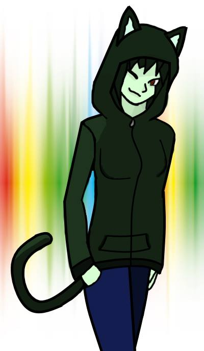
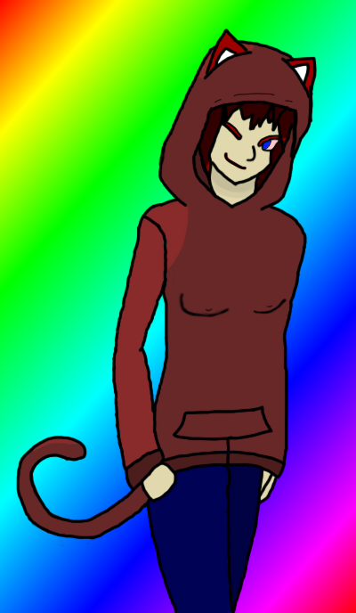
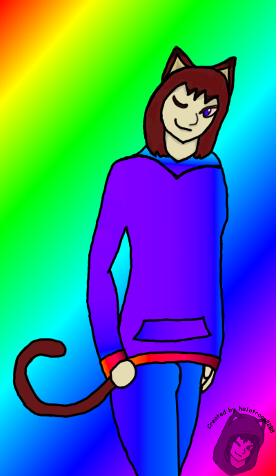
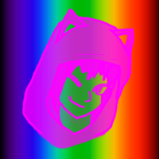
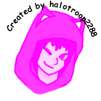
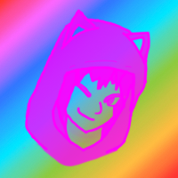
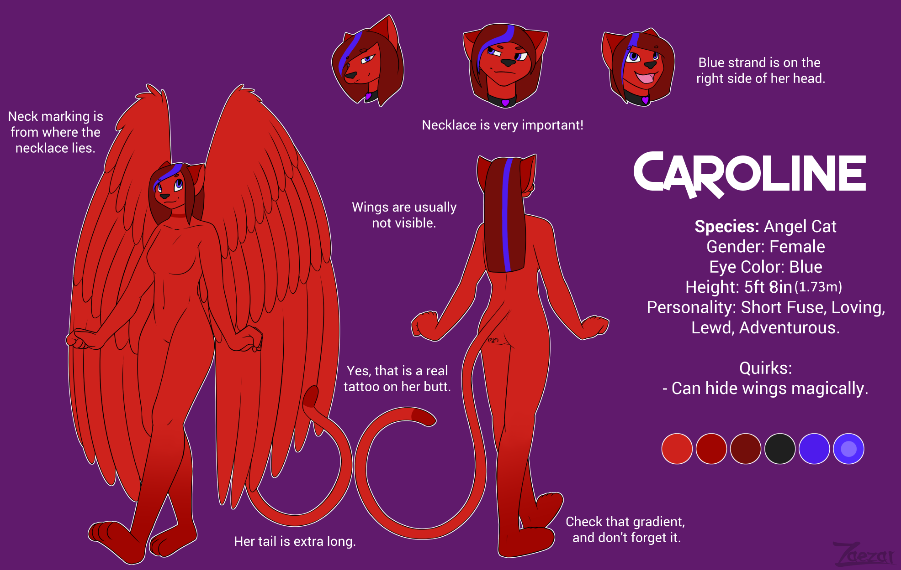
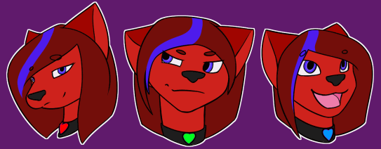

Caroline, quite simply, is my fursona. She's been developing in my mind for quite some time.
The earliest memories I have of developing her as a character were from when I was a pre-teen.

## Character Development

Caroline is a constantly evolving character.
It took years for her to reach her current design, and I'm not done yet!

### Adolescence

My hormonal changes from my [first puberty](https://lexicon.library.lgbt/definitions/second-puberty/)
played a large part in the development of her as a character.

Caroline started out as what I liked to call my "ideal woman" back when I wasn't very
in-touch with my identity. At the time, I didn't know my sexuality, didn't have a firm grasp
on my ideology, and I certainly didn't have a grasp of my gender.
In short, I was young, and still finding myself.

At the time, Caroline as a character had these qualities:

- Female
- Red hair
- Blue eyes
- Wears a red dress

There was nothing more to her at that point. I never drew her, I mostly used her as a character in games.
This was just how I liked to customize my character in most games.

### Gaming

I have always used Caroline as my in-game character whenever customization is possible in
a video game. Using "myself" always felt strange and uncomfortable.

Years of playing with this character taught me exactly what I wanted her to be:

- Female (if nothing else, then always this! :transgender_flag:)
- Cat-like, if possible (the [Khajit race in TES](https://elderscrolls.fandom.com/wiki/Khajiit) for instance) 
  If this limits the color options, then I choose this over color customization
- Red hair
- Blue eyes
- Red clothing, more specifically a dress if possible 
  This is because red was my favorite color for the longest time. 
  (Now, my favorite color is purple.)
- Slightly pointed jaw

---

This is ***my*** first drawing of *Caroline*. This character didn't have a name at the time.
I was just getting into furry art, and barely knew what the furry fandom was.

This is probably some of my best work, since I never put in the time to learn how to draw.
I'm quite proud of what I could make at the time. These days I can barely trace a drawing. 
And this drawing is vital to the history of the character.
Without it, I might have kept thinking of her as just
my "ideal woman" and that's just icky to me, now.

??? warning "Alternate Versions - A brief history of my own art"
    This is the second version I made of this drawing.
    To me, it looks noticeably worse.
    It has sloppy lines that I tried to clean up instead of redrawing them.
    It has worse colors, and I just entirely forgot to remove some blemishes.
    I even tried to get away with adding badly drawn nipples to it,
    after drawing the bust shape worse!

    Yet this is still a step forward for the character herself.
    It officially introduces the blue eyes and red hair.
    It also introduces the red fur, though you can barely see it,
    since I'm still drawing her as a neko with hair that doesn't match.

    

    I made this variation in 2016, while uploading the last one to [DeviantArt].
    I removed the hood from her head to show her hair.
    I tried to make it look like the hood was still behind her head, though.

    Instead of recoloring the image using my usual technique (at the time)
    of painstakingly drawing around the outline of the image on the next layer down,
    then using the paint bucket tool to fill it in,
    and finally using the paintbrush to fix the jagged edge on that broken fill... 
    I tried to get around it by just using the same gradient image that I used in the background,
    but at a different angle.

    This looks even more ridiculous to me.
    It changes her head shape to not look so big because of the hoodie,
    and it removes the blemishes that were added in the previous version.
    The gradient somehow manages to look better than the color scheme I set for the previous one,
    but it's still way worse than the first version.

    That's all the positives I can think of. This piece is mostly a downgrade.
    I got rid of all the shading, over-used gradients on everything,
    made it look like her tail is connected to the front of her leg,
    and got rid of her at-the-time iconic hood!

    

    This piece is also the first ever to use my watermark,
    which was based on my favorite part of the previous version of this piece:
    The head.

    I never saved an un-edited copy of that watermark, unfortunately. 
    All I have left are these variations:

    
    
    

    But I never actually used these by themselves.
    I kept a project file around that I would cut out and edit to fit the scenario.
    I never uploaded or archived those pieces, so you'll just have to take my word for it.
    The art that I did upload to [DeviantArt] later was not watermarked.

### My first game

When I started making my own game [Basuoland],
I chose to insert her into that game too.

This is a bit of a problem for me. I cannot bring myself to make new characters.
So I always insert this same character into any given scenario.

!!! info "Continue"
    :arrow_right: Continued in [Basuoland: Characters](/caroline/projects/basuoland#characters).

### The character designer

Up to this point, I still did not have a concrete representation of my fursona.
Some people in the furry community offered to draw her for me, but I never had a clear idea
of what she should look like.

*Enter: [Zaezar],* the profession character designer and furry artist.

I discovered [Zaezar] on YouTube, where he had a series of tutorials about drawing anthro characters.
I followed him on Twitch for some time, and became a regular member of his community.

One day, I came into a larger-than-usual amount of money and decided (regrettably) to commission
him with it. (The money was only for food that month, as I later found out.)

He drew this amazing reference image for my character, and I was super excited to see it.
He drew it oh his live stream, so I got to watch and weigh in on every detail. He helped me
decide which features were good to keep, what should be added to make it more interesting,
and which ones should be changed, to look nicer.

In the end, he came up with this, and I love it: 

## Characteristics

After all that, here's what we know about Caroline...

### Physical

- Angel cat
- 5ft 8in <!-- Considering changing this in a redesign -->
- Red fur (#CE221C)
- Dark red hair (#730E0A)
- Has a blue streak in her hair (#4E1BEC)
- Blue eyes (#522BFF) that are lighter (#8266FF) in the center
- Has a "Lenny" face tattoo on her left butt cheek
- Tail is the same fur color except for the tip, which matches the bottom of her feet (#A00500)
- Gradient of a darker red (#A00500) from the bottom of her feet to half-way up her calves.
- Pink inner mouth (#E95994)
- Pink tongue (#ED7CAB)
- Always wears a black collar (#1F1F1F) with a heart pendant,
so much that it leaves a visible dark mark underneath (#A00500)
- Heart pendant changes color based on mood, but you can use purple (#A700FD) as a default
    - **Purple:** Calm / Indifferent
    - **Red:** Horny / Lovey / Angry / Enraged
    - **Light Green:** Devious / Defiant
    - **Dark Green:** Envious / Jealous
    - **Light Blue:** Happy / Silly
    - **Dark Blue:** Sad / Lonely
    - **Dark Grey:** Depressed
    - **Black:** Dead

??? message "Mood Pendant Edits"
    Here's a more accurate representation of the mood pendant on Caroline's collar: 
    

### Social / Mental

- she/her
- Favorite color: purple (#601A6C)
- Neutral-good, short fuse, loving, lewd, adventurous

??? info "Dungeons and Dragons"
    If Caroline were a 5th Edition DnD character, this would be her stats:

    **[Caroline the Tabaxi](https://chicken-dinner.com/5e/5e-point-buy.html#tabaxi&NA&11&12&10&14&10&15&0&0&27&15&8&19&15&12&9&7&5&4&3&2&1&0&1&2&4&6&9&4&4&4&4&4&4)**

      - **Race**: Tabaxi
      - **Strength:** 11
      - **Dexterity:** 14 (+2 racial bonus)
      - **Constitution:** 10
      - **Intelligence:** 14
      - **Wisdom:** 10
      - **Charisma:** 16 (+1 racial bonus)
      - **Walking Speed:** 30 feet
      - **Climbing Speed:** 20 feet
      - **Languages:**
        - Common
        - Draconic (racial bonus)

<!-- Static Links -->

[CJ]:../cj
[Ashley]:../ashley
[Violet]:../violet
[Basuoland]:../basuoland
[DeviantArt]:https://www.deviantart.com/halotroop2288
[Zaezar]:https://zaezardraws.com
