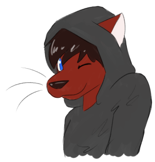

# CJ Bell

CJ Bell is the more masculine alter-ego of [Caroline Joy Bell](../caroline).

He has his own [art gallery](art-gallery), but hasn't been developed as a character as well as [Caroline](../caroline)
or gotten as much [art](../caroline/art-gallery) as her since she got an official reference sheet.

## Characteristics

For lack of a true reference for his design as a character,
here's what we know about CJ:

- Feline
- He/Him (or They/Them)
- Favorite color: Red
- Always wears a hoodie
- Has dark red fur (#8C281C)
- Has dark brown hair (#2B1613), and keeps it short
- Has pale white skin (#FAEEED), as seen inside his ears
- Has blue eyes (#2A6DF9), but flat instead of gradient like his female counterpart
- ? chest
- ? tail
- ? legs
- ? gonads

As far as his personality goes, I have no idea. Caroline is mostly a self-insert or a reflection of myself. CJ is a part of me that I rarely identify with.

We can see that he is portrayed as a goofball in at least one of his portraits, pulling his drawstrings closed over his face.

---

