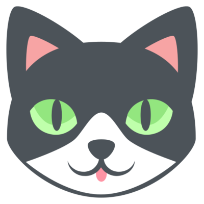

Hi, I'm Caroline. My [pronouns] are she/her. This is my website. :caroline-smile:

This section is about me, myself, and I. A sort of introduction to me.
In the following sections, you can find out more about my life
by following me on my social media pages below.

## Background

I'm a non-binary trans woman, a furry programmer, and a virtual sandbox enthusiast. 
For a long time, I used to make and contribute to mods for Minecraft,
but I've never found any happiness in it, so I stopped in 2022.

I still (try) to make games in my free time. Mostly based on other games, but I do have other ideas! 
Until a couple years ago, I dreamed of working at [Valve](https://valvesoftware.com), and I even tried to get into technical school for it,
but reality set it. They are only looking for the best and brightest, and I am not that.
I think I'm OK with that.  
Now I dream of working at a smaller company on indie games or ports of existing games.

## Navigation

Check out [my fursona] and other characters,
and reading about my [projects](projects),
both the alive, and the [dead](projects/dead)! 
There's also an [art gallery](art-gallery) of [my fursona], and an experimental [videos] page. 

When you're done with that, you can follow me on social media, by using the links below.
Or in case you want to chat, there are ways to contect me below as well.

## Social

??? info "Social Media"
    If you feel so inclined, you can follow me on social media,
    where I will make updates far more frequently, as it takes way less effort!

    I used to use Twitter, but after it was bought by Elongated Muskrat,
    the site became unusable, and the site policies became transphobic. Join the Fediverse today! 
    ***My Twitter accounts are deactivated. Anyone claiming to be me on Twitter / X.com is an imposter!***

    <a href="https://meow.social/@halotroop2288" title="Meow.Social">
      
      meow.social
    </a>
    <a href="https://techhub.social/@halotroop2288" title="TechHub.Social">
      techhub.social
    </a>
    <a href="https://halotroop2288.newgrounds.com" title="Newgrounds">
      
      newgrounds.com
    </a>
    <a href="https://spacehey.com/halotroop2288" title="Spacehey">
      
      spacehey.com
    </a>
    <a href="https://patreon.com/halotroop2288" title="Patreon">
      
      patreon.com
    </a>

??? message "Contact Me"
    If you'd like to contact me for business purposes, I can be reached at
    [halotroop2288@proton.me](mailto://halotroop2288@proton.me "My email address").

    For private discussion of this website, please contact me at
    [admin@halotroop.com](mailto://admin@halotroop.com)

    Or you can add me on Discord, if you must: `@halotroop2288`.
    But I'll warn you now, I don't like the platform. And I might not be there forever.

    The best place to reach me if you want to chat is to join my [Revolt guild].

<!-- Static Links --->

[blog]:/caroline/blog
[my fursona]:/caroline/characters/caroline
[videos]:/caroline/videos
[pronouns]:https://pronouns.page/@halotroop2288
[Revolt]:https://revolt.chat
[Revolt guild]:https://rvlt.gg/EmND69QW
