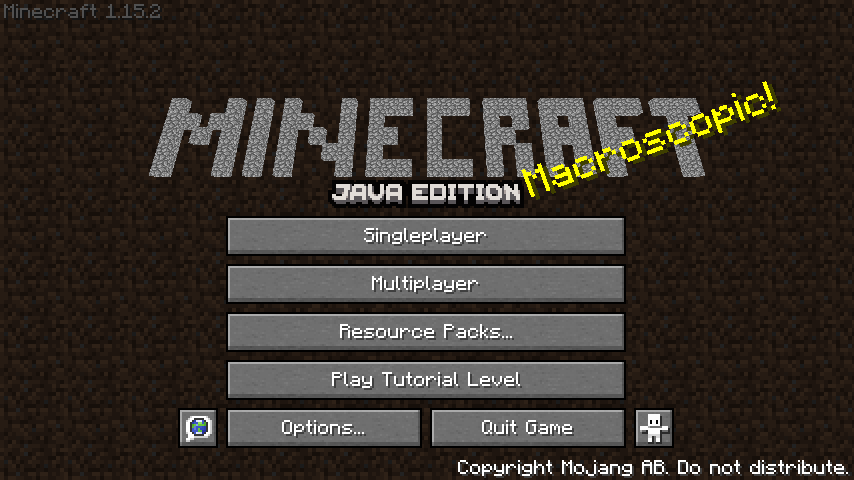
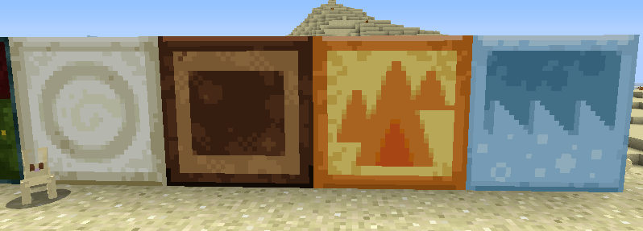

Ex-Features was my first attempt at making a Minecraft mod with an original concept. 

## Background

[Minecraft] has had an interesting history with scrapped features.
Some were removed in the early stages of the game,
some were never released (but were shown off by the developer(s)),
and some were planned but just forgotten about!

[I] got the idea for this mod from several YouTube videos that discussed the history of these features. 
[I] thought to myself that some of them were a no-brainer to add back in.
Things such as the more interesting title screen that builds its logo out of stone blocks,
and elemental paintings that never made their way to Java Edition were some obvious examples.
But [I] also had an interest in other features like the red dragon, the sky dimension, cogs, and furniture.

This mod met its fate when [I] got bored of working on it,
but it still, to my knowledge, not have a functional competitor on Fabric. 
A team called ModdingLegacy made a similar mod for Forge,
but they did not seem interested in supporting Fabric.

## Source Code

You can view the source code for this mod [on GitHub](https://github.com/halotroop2288/ex-features-mod).

The GPLv3 I chose for it after some debate is not actually valid though, so I waive my copyright to it.
You may do what you please with the source code, which is more in line with the original WTFPL,
which is completely permissive, and essentially public domain.

## Screenshots

<!-- Static Links -->

[Minecraft]:https://minecraft.net
[I]:/caroline
