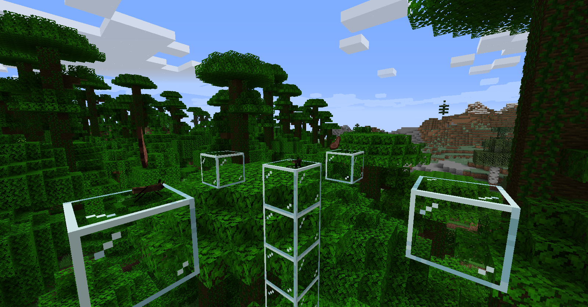

# Mo' Creatures

[Mo' Creatures](https://www.mocreatures.org/) was a mod by Dr. Zhark
that added lots of animals and other creatures to the game. 
It had its source code released under
[GPLv3](https://github.com/DrZhark/mocreaturesdev/blob/master/License.txt) in 2019.

I was porting it to [Fabric] while I waited for the original creator of
[More Creeps and Weirdos](/caroline/projects/dead/morecreeps) to respond
to me about the licensing of that mod.
But ultimately, [I lost interest in working](/caroline/projects/dead#Retirement_from_programming) on both of the mods.

My original goal was to first port all the creatures that had not yet made it
into vanilla Minecraft through updates. Then, if I finished those, vanilla
creatures (like Rabbits, Horses, and Cats) would start to get features from the mod.

I would have started with 1.14.4, then updated the mod to newer versions to cover
all the modern versions that Fabric supports. But at one point I was considering moving to supporting only *one* version. 
See *[Better Than Updates](/btu)* for details.

You can download the original mod **[HERE](https://www.curseforge.com/minecraft/mc-mods/mo-creatures/files/2628698)**.

You can view the source code for my fork **[HERE](https://github.com/halotroop2288/Mo-Creatures)**.

<!-- Mod remains unreleased.

You can download my Fabric port of Mo’ Creatures [on the Github releases page](https://github.com/halotroop2288/Mo-Creatures/releases/latest).
Just grab the latest JAR file.

-->

## [Mobs](https://mocreatures.fandom.com/wiki/Category:Entity)
Here's the current list of mobs that have been added.

Keep in mind, I'm targeting the whole list of mobs
from Mo' Creatures 12, minus obsolete ones, like Wolves, Kitties, Turtles, etc.
Which will eventually have the option of implementing into vanilla mobs with their features/models.

### [Ants](https://mocreatures.fandom.com/wiki/Ant)

Ants wander around and look for food to pick up, and then carry it around wherever they go.

I had planned on making them follow each other around and bring food back to a nest.

### [Birds](https://mocreatures.fandom.com/wiki/Bird)

Birds are like parrots, but uh... different-looking?
They each have their own ambient noise and can be tamed.

They would have given you slow-falling if you have them sit on your head, in my version.

### [Bunnies](https://mocreatures.fandom.com/wiki/Bunny)

[Rabbits](https://minecraft.fandom.com/wiki/Rabbit) were added to vanilla Minecraft in release 1.8.

It's unlikely I would have changed much about them in my version,
except maybe adding back their original models.

### [Butterflies and Moths](https://mocreatures.fandom.com/wiki/Butterfly)

Many species of butterflies and moths can be found in the world of Mo' Creatures, including:

 - [Agalais urticae (Small Tortoiseshell)](https://en.wikipedia.org/wiki/Small_Tortoiseshell)
 - [Argyreus hyperbius (Indian Fritillary)](https://en.wikipedia.org/wiki/Argynnis_hyperbius)
 - [Athyma nefte (Colour Sergeant)](https://en.wikipedia.org/wiki/Athyma_nefte)
 - [Catopsilia pomona (Lemon Emigrant)](https://en.wikipedia.org/wiki/Catopsilia_pomona)
 - [Morpho peleides (The Emperor)](https://en.wikipedia.org/wiki/Morpho_peleides)
 - [Vanessa atalanta (Red Admiral)](https://en.wikipedia.org/wiki/Vanessa_atalanta)
 - [Pieris rapae (Cabbage White)](https://en.wikipedia.org/wiki/Pieris_rapae)
 
 - [Camptogramma bilineata (Yellow Shell)](https://en.wikipedia.org/wiki/Camptogramma_bilineata)
 - [Idia aemula (Powdered Snout)](https://en.wikipedia.org/wiki/Idia_aemula)
 - [Thyatira batis (Peach Blossom)](https://en.wikipedia.org/wiki/Peach_blossom)

<!-- Static Links -->
[Fabric]:https://fabricmc.net/