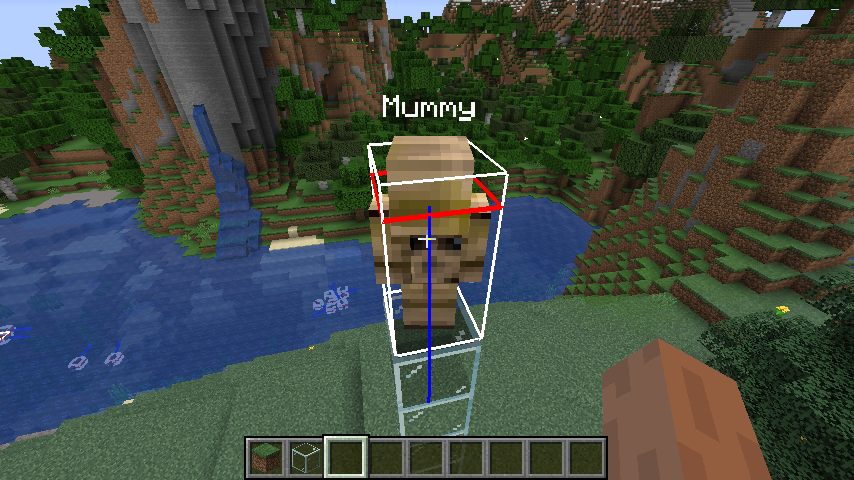
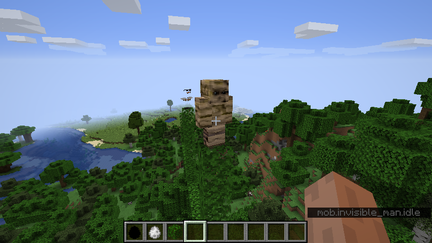
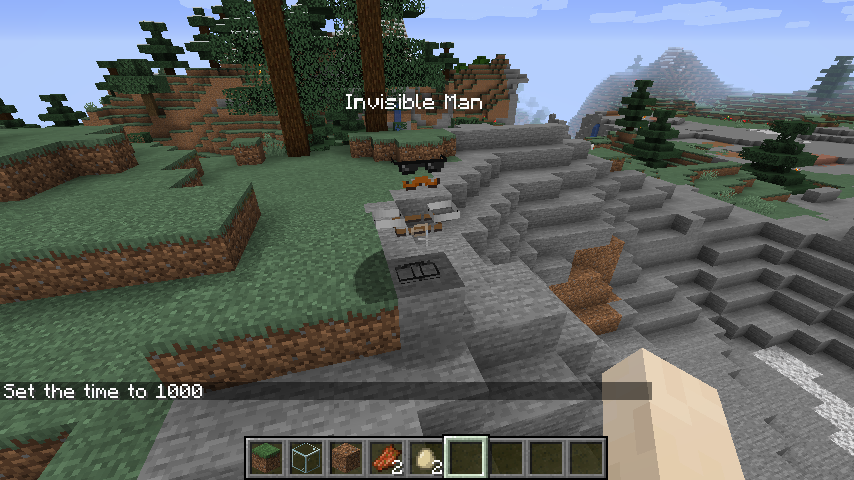

This was an attempt to recreate the classic [Minecraft] mod,
[More Creeps and Weirdos](http://morecreeps.com) for the [Fabric Mod Loader](https://fabricmc.net).

## Background

[My](/caroline) first introduction to Minecraft was through [IHasCupquake]'s original [Minecraft release series] on YouTube.
In that series she had some touching moments that I look back on with great nostalgia.<br>
I set a goal of accurately recreating the world which she never uploaded (unlike in her [Minecraft beta series]),
in the latest version of Minecraft.
(She revealed the full world seed in [episode 2](https://www.youtube.com/watch?v=7mfcOWdMNPE).
An important step in that plan would be to have the same mods installed.<br>
So, after painstakingly following her every action for the first 6 episodes,
and guessing what she did off-screen (and later checking my work),
I set out to make sure all the mods in that original series were available in the latest version of Minecraft,
with the Fabric Loader.
I found that almost none of them had made it up to version 1.14 when I started this project,
and zero of them were ever ported to Fabric at that point.

In the end, I accidentally deleted that whole world and then gave up on it when I realized I didn't have a backup.
I kept working on the mod though, because it is still one of the most creative
and interesting mods I've ever seen for Minecraft.<br>
I later attempted the same thing with the FTB: Classic map that [Direwolf20] played around the same time,
much like [More Creeps], it's still one of the most interesting maps I've ever seen in Minecraft.

The mod died later, when I got burnt out with working on it.
The game had changed so much that each feature I had to implement
took a lot of research and artistic deviation to make it work.
I eventually got tired of trying to translate the old system to the new one.

---

## Source Code

**The [source code](https://github.com/halotroop2288/more-creeps-refabricated) is not public, for this project, unfortunately.**

??? info "Why?"
    According to the license terms included with [the original mod](https://www.minecraftforum.net/forums/mapping-and-modding-java-edition/minecraft-mods/1272354),
    creating modified versions for personal use is OK, but redistributing them is not.
    I would like to stay on good terms with the author,
    so I was going to allow him to review it first, and ask him for permission to release it.

    A relevant excerpt from the license terms of the original mod:

    ```
    1. REDISTRIBUTION
    This MOD may only be distributed where uploaded, mirrored, or otherwise linked to by the OWNER solely.
    All mirrors of this mod must have advance written permission from the OWNER.
    ANY attempts to make money off of this MOD (selling, selling modified versions, adfly, sharecash, etc.) are STRICTLY FORBIDDEN,
    and the OWNER may claim damages or take other action to rectify the situation.
    
    4. DERIVATIVE WORKS/MODIFICATION
    This mod is provided freely and may be decompiled and modified for private use, either with a decompiler or a bytecode editor.
    Public distribution of modified versions of this MOD require advance written permission of the OWNER and may be subject to certain terms.
    ```

    I did reach out to the author, Freakstrich about licensing this mod to me for distribution,
    but since it was never finished, I didn't have much to show him.

## Goals

The recreation would have mainly focused on porting More Creeps to the latest version of [Minecraft].
(1.14 at the time I started, 1.16.3 when I finally gave up, 1.18.2 would have been the latest version I ever supported if I had finished it.)

I really wanted to bring back Guinea Pigs and HotDogs as a main focus,
but I decided to start with the earliest-added mobs from the mod instead.
Starting with the first release of the mod, and moving up through each release to see the changes.

## Screenshots

This is about as far as I got.





<!-- Static Links -->

[More Creeps]:http://morecreeps.com
[Minecraft]:https://www.minecraft.net
[IHasCupquake]:https://www.youtube.com/@iHasCupquake
[Minecraft release series]:https://www.youtube.com/watch?v=yJbYMsru5Fk&list=PL6D4343236F7D72BB
[Minecraft beta series]:https://www.youtube.com/watch?v=uIAub6YbUe8&list=PL2FF62BD62133D1F7
